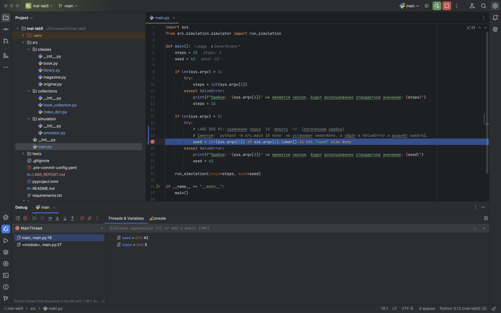
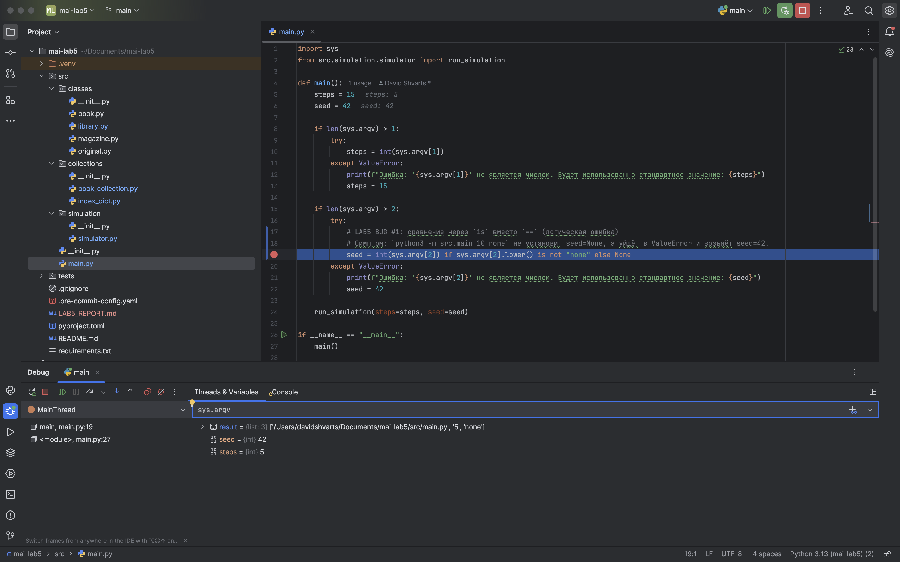
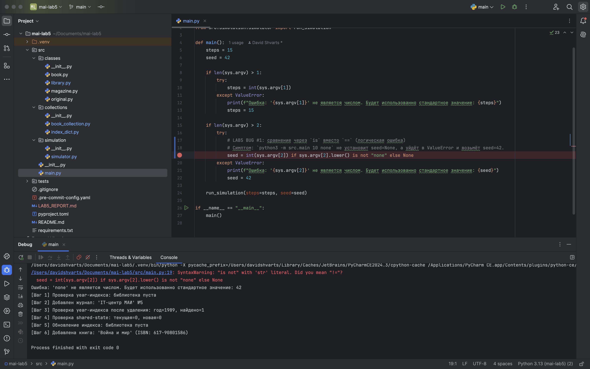
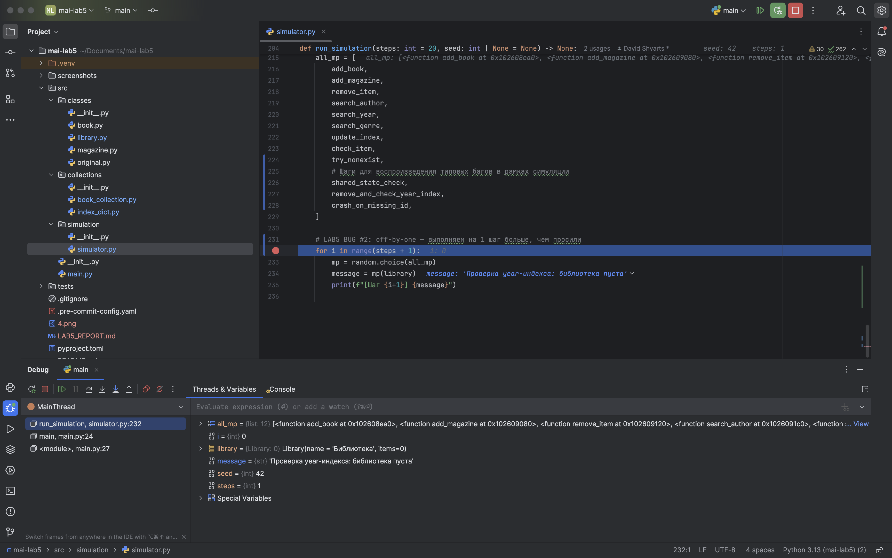
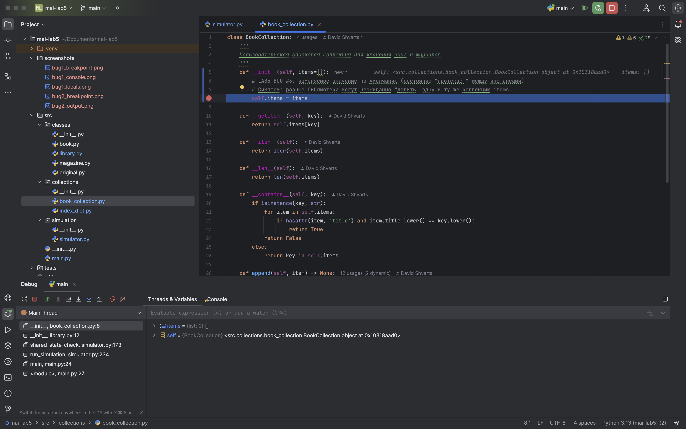
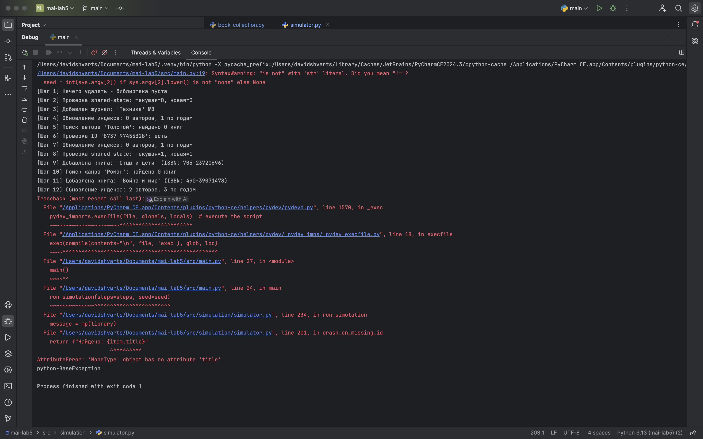
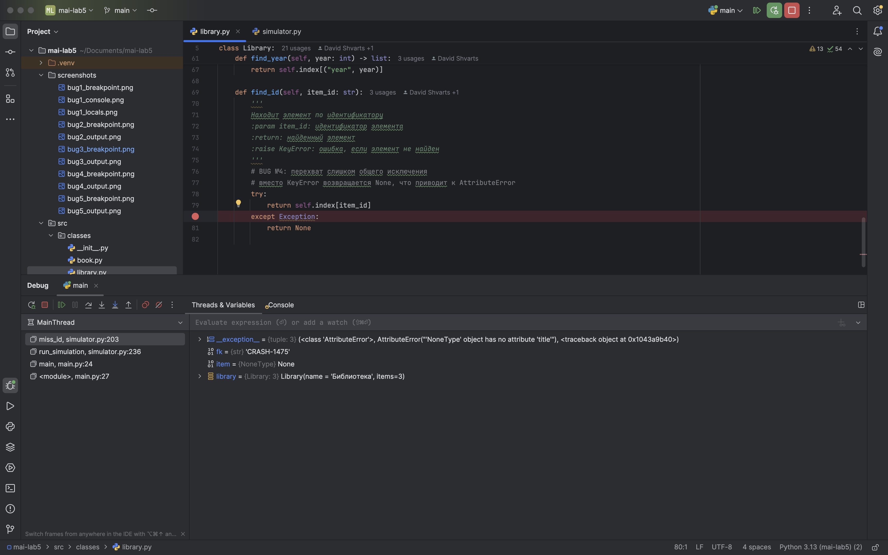
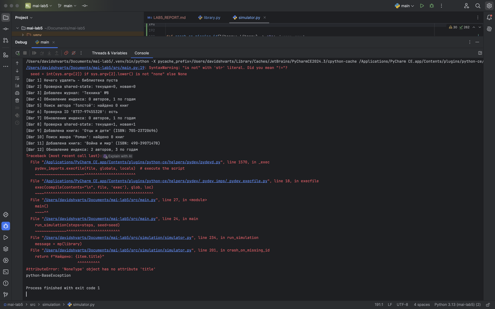
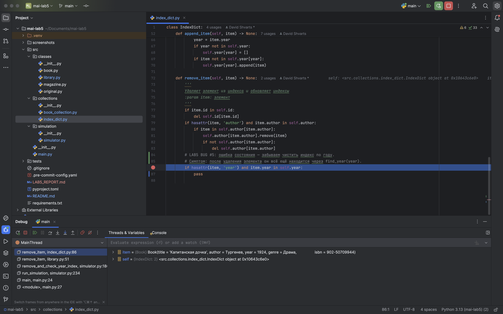
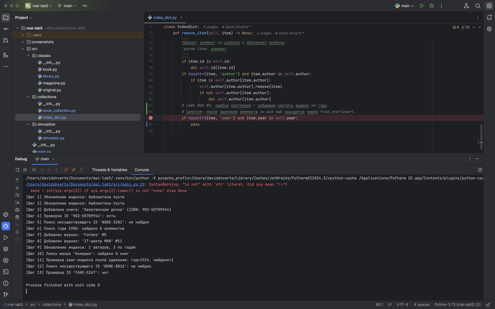

## Лабораторная работа №5

Запуск симуляции: `python3 -m src.main <steps> <seed|none>`

---

### Ошибка 1 — сравнение через `is` вместо `==`

Место: `src/main.py`, функция `main`  

Симптом: 
При запуске с `none` вместо `seed=None` используется стандартный `seed=42`.

Как воспроизвести:  
Запустить симуляцию с `steps=5`, `seed=none`:

```bash
python3 -m src.main 5 none
```

Отладка:  
Установить breakpoint на строке: `seed = int(sys.argv[2]) if sys.argv[2].lower() is not "none" else None`  
Проверить в отладчике значения `sys.argv`, `sys.argv[2]`, `sys.argv[2].lower()` и убедиться, что выполняется неверная ветка и попадаем в `except ValueError`.

Причина:  
Использовано сравнение `is` вместо `==`.

Исправление:  
Заменить `is not "none"` на `!= "none"`.

Проверка:  
Повторить запуск `python3 -m src.main 5 none` — `seed` должен стать `None`, сообщение об ошибке не появляется.

Доказательства:






### Ошибка 2 — ошибĸа границы циĸла (off-by-one)

Место: `src/simulation/simulator.py`, функция `run_simulation`  

Симптом: при `steps=1` выполняется 2 шага (на 1 больше).

Как воспроизвести:  

```bash
python3 -m src.main 1 42
```

Отладка:  
Установить breakpoint на строке `for i in range(steps + 1):`.  
Проверить `steps` и `i`: на последней итерации будет `i == steps`, что и даёт лишний шаг.

Причина:  
Неверная граница цикла (`range(steps + 1)` вместо `range(steps)`).

Исправление:  
Заменить `range(steps + 1)` на `range(steps)`.

Проверка:  
Запустить `python3 -m src.main 1 42` — выводится ровно один шаг.

Доказательства:



### Ошибка 3 — использование изменяемого значения по умолчанию

Место: `src/collections/book_collection.py`, метод `BookCollection.__init__`  

Симптом: новая библиотека неожиданно содержит элементы из другой (коллекция `items` “общая”).

Как воспроизвести:  

```bash
python3 -m src.main 12 1
```

Отладка:  
Установить breakpoint на строке `self.items = items`.  
В отладчике сравнить `id(self.items)` у двух разных объектов `Library()` — идентификаторы совпадают.

Причина:  
Использован список как значение по умолчанию (`items=[]`).

Исправление:  
Заменить на `__init__(self, items=None)` и внутри делать `self.items = []` при `items is None`.

Проверка:  
Повторить запуск с `seed=1` — новая библиотека должна начинаться с пустой коллекции.

Доказательства:




### Ошибка 4 — перехват слишком общего исключения

Место: `src/classes/library.py`, метод `find_id`  

Симптом: вместо `KeyError` возвращается `None`, что приводит к `AttributeError` в симуляции.

Как воспроизвести:  

```bash
python3 -m src.main 12 1
```

Отладка:  
Установить breakpoint на `except Exception:` в `find_id`.  
Убедиться, что `KeyError` перехвачен, и функция возвращает `None`.  
В стеке видно падение у `None` (`AttributeError`).

Причина:  
Перехватывается слишком общее исключение (`Exception`).

Исправление:  
Убрать `except Exception` или ловить только `KeyError`.

Проверка:  
Повторить запуск — при обращении к несуществующему ID должна быть корректная обработка (например `KeyError`).

Доказательства:




### Ошибка 5 — ошибĸа состояния (флаг/переменная не сбрасывается)

Место: `src/collections/index_dict.py`, метод `remove_item`  

Симптом: после удаления элемент остаётся в индексе по году и находится через `find_year(year)`.

Как воспроизвести:  

```bash
python3 -m src.main 12 0
```

Отладка:  
Установить breakpoint на строчке `if hasattr(item, 'year') and item.year in self.year:`.  
Проверить `self.year[item.year]` до и после удаления — список не меняется.

Причина:  
Код удаления из `self.year[year]` не выполняется, индекс остаётся.

Исправление:  
Восстановить удаление элемента из `self.year[year]` и очистку пустых списков.

Проверка:  
Повторить запуск — после удаления `find_year(year)` не должен возвращать удалённый элемент.

Доказательства:





